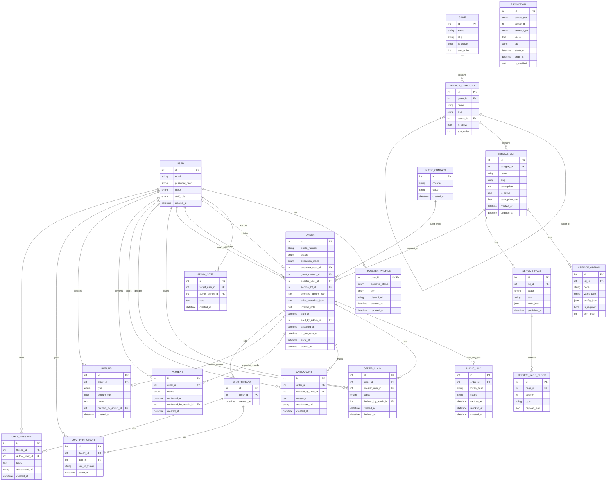
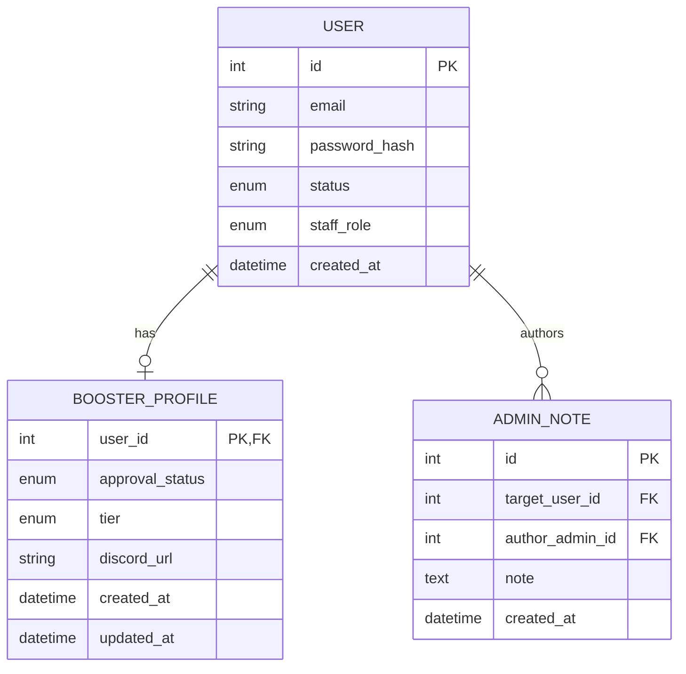
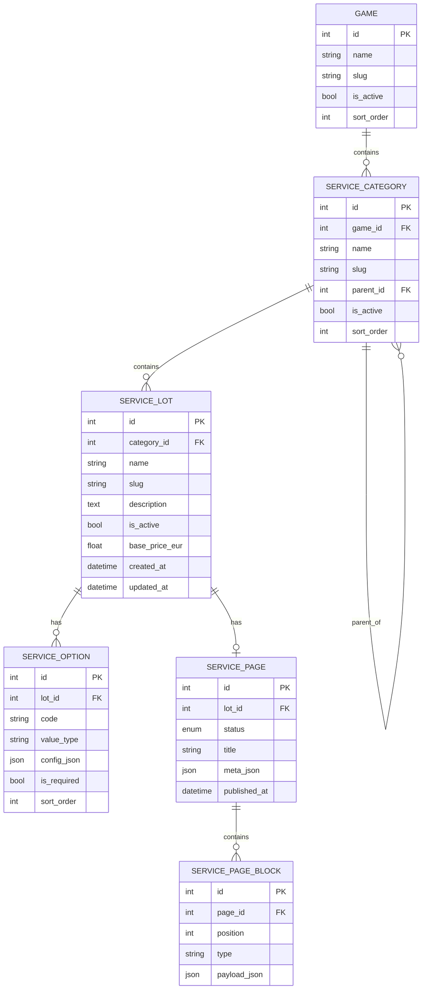
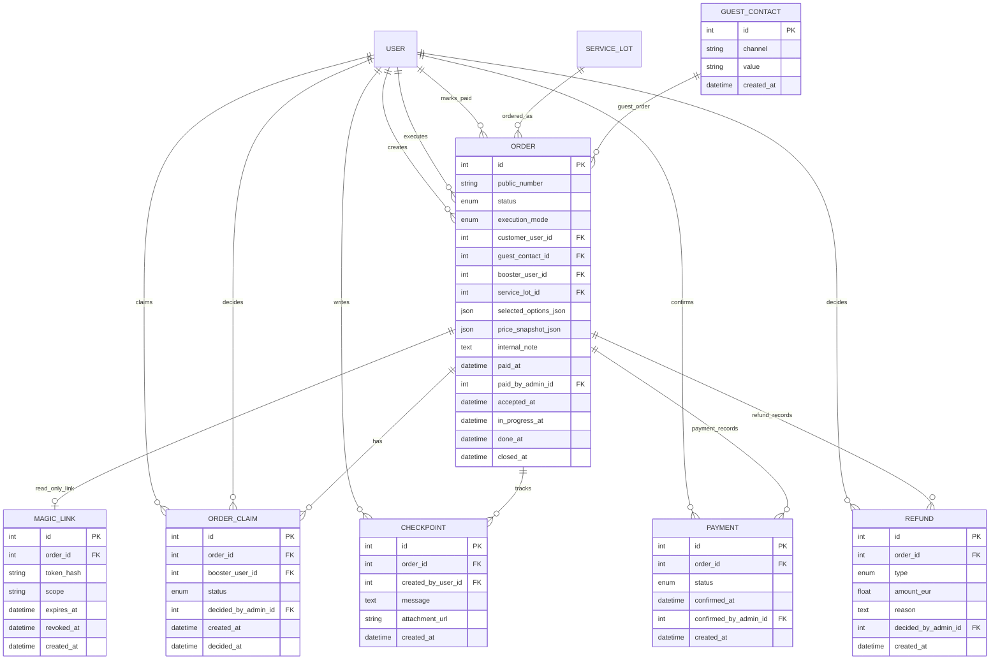
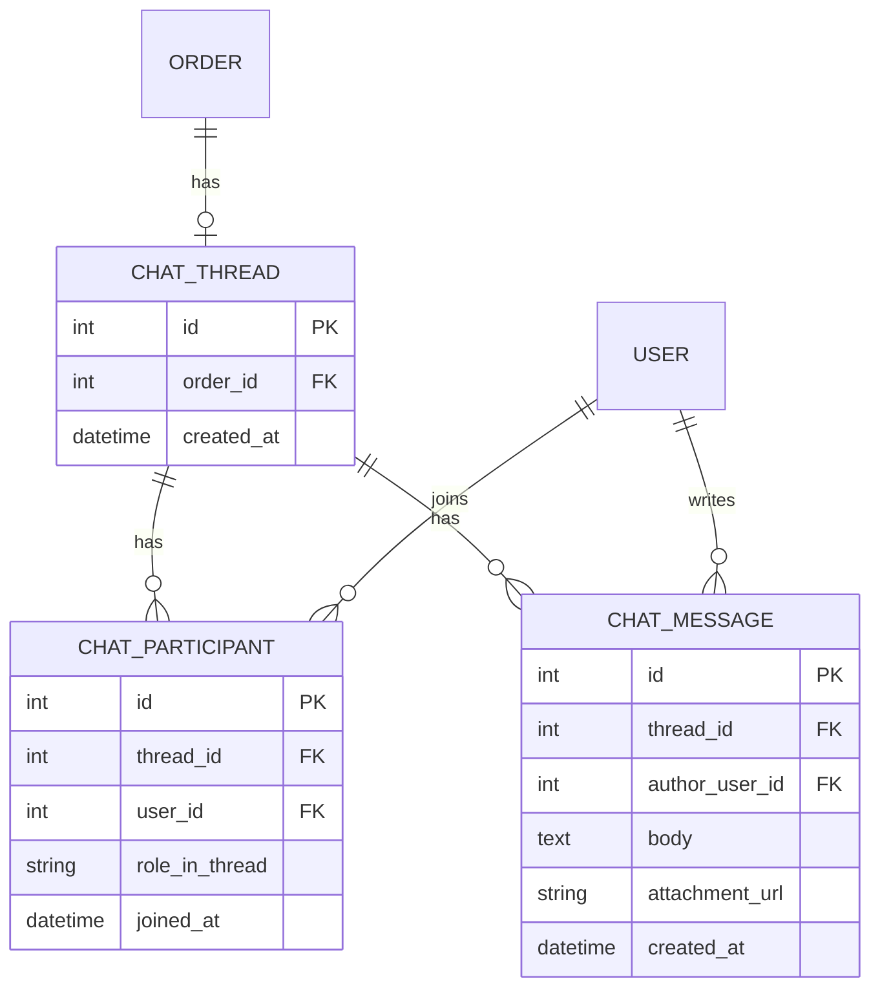
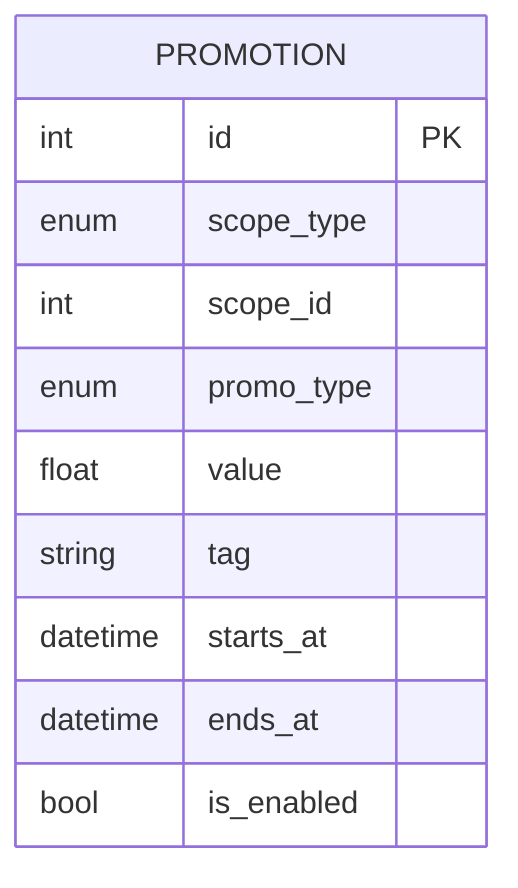

# WowShop

Черновик backend/domain модели для WoW boosting marketplace.

Основа берётся из [WowBl.md](/Users/vitalii/Projects/WowShop/docs/WowBl.md): один заказ = один лот, backend считает цену, оплата на MVP подтверждается вручную админом, бустер получает заказ только после `Paid`.

## Текущие решения

- `User` — базовая учетная запись.
- Любой зарегистрированный `User` может быть customer без отдельной роли.
- Backoffice-доступ хранится в `User.staff_role`.
- Бустер определяется не ролью, а наличием `BoosterProfile`.
- `BoosterProfile.user_id` — одновременно `PK` и `FK -> users.id`, то есть это расширение `User` в связи `1:0..1`.
- Каталог иерархический: `Game -> ServiceCategory (tree) -> ServiceLot`.
- Прайс на MVP считается от `ServiceLot.base_price_eur` и выбранных `ServiceOption`.
- `PricingRuleSet` пока не активирован в текущем ORM, оставлен как future-вариант в доменной документации.

## Pricing MVP

Сейчас pricing устроен так:

- у лота есть базовая цена `base_price_eur`
- у опций есть конфиг и ценовой эффект в `config_json`
- итоговая цена заказа считается на backend
- результат расчета фиксируется в `Order.price_snapshot_json`

Упрощенная формула:

```text
final_price = service_lot.base_price_eur + sum(selected option price deltas)
```

Примеры того, что может лежать в `ServiceOption.config_json`:

```json
{
  "choices": [
    { "value": "self_play", "label": "Self Play", "price_delta": 0 },
    { "value": "piloted", "label": "Piloted", "price_delta": 15 }
  ]
}
```

```json
{
  "type": "boolean",
  "true_price_delta": 8,
  "false_price_delta": 0
}
```

## Полная модель

`Promotion` использует полиморфную связку `scope_type + scope_id`, поэтому на диаграмме показывается без прямого FK на категорию или лот.



## Разбиение по доменам

### Users and Access



### Catalog and Content



### Orders and Fulfillment



### Chat and Messaging



### Promotions



## Что не активно сейчас

- `PricingRuleSet` — пока не активирован в текущем ORM (future-вариант)
- `PageBlockTypeSchema` — отключён
- `Dispute`, `OrderTimelineEvent`, notification-модели — пока не активированы в `models.py`
